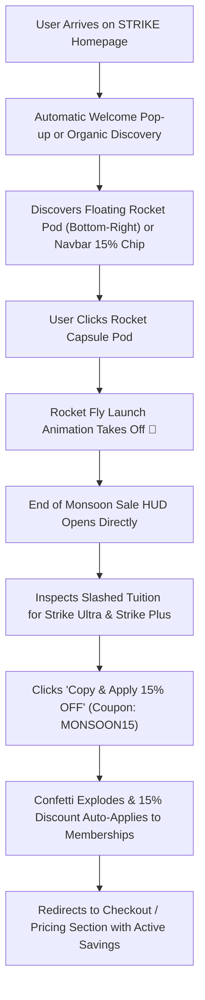

# ⚡ STRIKE (strikes.in) - High-Fidelity Frontend & End of Monsoon Sale Experience

> **A pixel-perfect, first-principles recreation of the STRIKE homepage (`strikes.in`) built with pure JavaScript (React 19 + Vite + Tailwind CSS + Framer Motion), featuring deep pitch-black styling, interactive learning tracks, industry-vet mentors, and an aerospace-inspired Rocket Launch "End of Monsoon Sale" (15% OFF).**

---

## 📺 Demo Video & Concept Overview

> **Demo Video Link**: [Watch the STRIKE Walkthrough & Sale Experience Demo](https://youtu.be/your-demo-video-link-here)  
> *(Replace the URL above with your hosted video link e.g. Loom, YouTube, or Google Drive)*

### 🧠 Thought Process & Point of View Behind the Sale Experience:
1. **The Core Philosophy**:
   - Traditional e-commerce websites bombard users with aggressive, flashing discount popups that feel spammy and dilute brand authority.
   - For an elite tech platform like **STRIKE** (which stands for deep computer science, distributed architectures, and first-principles mastery), the sale experience needed to feel **aerodynamic, intentional, high-contrast, and empowering**.
2. **Why This Approach (The Rocket Launcher Experience)**:
   - Instead of standard passive banners, we engineered a floating **Aerospace Rocket Capsule** at the bottom-right that sits unobtrusively with a live amber countdown clock.
   - When users click to explore the grant, a physics-based **Rocket Launch Fly Animation** launches upward off the screen, propelling the user into the **End of Monsoon Flash Sale HUD**.
   - The modal bypasses unnecessary hurdles and **directly displays the eligible membership tiers (Strike Ultra & Strike Plus)** with clear tuition slashing, instant coupon copying (`MONSOON15`), and celebratory visual feedback.
3. **How Users Discover & Interact with the Offer**:
   - **Organic Page Load Discovery**: An initial welcome view smoothly introduces the limited-time grant upon entering the platform.
   - **Navbar Flash Badge**: An animated amber/cyan batch status chip in the sticky header.
   - **Floating Rocket Launch Pod**: Persistent floating dock with real-time countdown timer (`HH:MM:SS left`).
   - **Hero & Pricing In-Line Triggers**: Direct voucher portal where users can test and apply `MONSOON15`.
4. **Why This Experience Converts Users**:
   - **Transparency & Direct Value**: Clearly breaks down the exact monetary savings (Save ₹2,400 on Strike Ultra / Save ₹1,500 on Strike Plus).
   - **Non-Manipulative Urgency**: A real 48-hour timestamp stored in `localStorage` ensures countdown integrity that doesn't artificially reset on simple browser refreshes.
   - **Exclusive Value-Adds**: Bundles high-leverage bonuses (3x 1-on-1 Resume Audits, GenAI Agent Template Kit, Rohit Negi Private AMA Pass).

---

## 🎯 Project Overview & Concept

The objective of this project is to build a full-featured, responsive, and performance-optimized recreation of the official **STRIKE** platform by Rohit Negi, while delivering a world-class, non-intrusive promotional experience.

### 🌟 Key Highlights:
- **Pure JavaScript Architecture**: Developed strictly in **JavaScript (`.jsx` / `.js`)**, avoiding TypeScript compilation overhead while adhering to clean component modularity.
- **Deep Pitch-Black Aesthetic**: Pure `#000000` background paired with fine-tuned neon glows (violet, cyan, amber), crisp typography (`Fira Sans` / `Fira Code`), and fintech-grade glass cards.
- **Dual Mentor Leadership**: High-detail mentor spotlights for both **Rohit Negi** (Founder, Ex-Uber SDE, AIR 202 GATE CS) and **Aditya Tandon** (Co-Founder, Distributed Systems Architect) with dedicated asset paths.
- **Interactive "Why Choose Us" Grid**: 4 animated interactive cards (*1-on-1 Interview Preparation*, *AI Assistant Tutor*, *Projects-Based Microservices Capstone*, and an *Active Practice Heatmap & Streak Widget*).
- **Targeted 15% Monsoon Offer**: Exclusive 15% discount applied directly to **Strike Ultra** and **Strike Plus** memberships.

---

## 🚀 Feature Checklist

### 1. STRIKE Core Homepage Experience
- [x] **Sticky Blur Navigation Bar**: Brand logo mark, quick navigation anchors, 15% monsoon voucher chip, and responsive mobile menu.
- [x] **Hero Section**: First-principles value proposition, social proof metrics (50k+ students, ₹2.05 Cr highest package, AIR 202 GATE, 4.98⭐ rating), and live interactive **Code Sandbox / REPL**.
- [x] **Top Tech Alumni Placement Marquee**: Animated infinite ticker displaying top hiring partners (Google, Uber, Microsoft, Amazon, Atlassian, Swiggy, Razorpay).
- [x] **Animated "Why Choose Us" Section**:
  - *Interview Preparation Card*: Live mock score visualization, line-by-line feedback, and ATS resume verification.
  - *AI Support Card*: Real-time complexity diagnostics (O(N²) $\rightarrow$ O(N)) and sub-50ms instant response tutor.
  - *Projects Based Learning Card*: Production microservices architecture flow (API Gateway, Kafka queue, Redis cluster, AWS).
  - *Track Your Progress Card*: Interactive 48-day streak counter with a clickable daily practice contribution heatmap.
- [x] **Course Catalog Grid with Category Filtering**: Filter across *All Courses*, *Live Bootcamps*, *DSA & C++*, *Generative AI & Agents*, and *System Design & DevOps*.
- [x] **Syllabus Modal Drawer**: Detailed multi-week module roadmap, topic breakdown, and prerequisites for every course.
- [x] **Mentor Spotlight**: Dual cards for Rohit Negi and Aditya Tandon with separate image paths, verified credentials, track records, and social handles.
- [x] **Pricing & Memberships Calculator**: Toggle duration between 1 to 4 years for **Strike Plus** and **Strike Ultra** with instant coupon recalculations.
- [x] **Verified Student Testimonials**: Real alumni reviews, verified package badges (₹45 LPA, ₹38 LPA, ₹32 LPA), and ratings.
- [x] **Interactive FAQ Accordion**: Smooth collapsible FAQ accordion answering doubts on live classes, recordings, Discord, and career assistance.
- [x] **Footer**: Comprehensive platform links, social channels (YouTube, LinkedIn, Instagram, Telegram), and trust badges.
- [x] **Scroll-Driven Entrance Animations**: Built with Framer Motion (`ScrollReveal`) for fluid staggered reveals across every section.

### 2. End of Monsoon Sale Experience (15% OFF)
- [x] **Targeted 15% Discount**: Slashes tuition specifically for **Strike Ultra** (₹15,999 $\rightarrow$ **₹13,599**) and **Strike Plus** (₹9,999 $\rightarrow$ **₹8,499**).
- [x] **Rocket-Style Floating Launch Pod**: Futuristic aerospace capsule with animated thruster glow, live ticking countdown (`HH:MM:SS left`), and "Claim Grant →" trigger.
- [x] **Rocket Fly Launch Animation**: Physics-based flight trajectory on click with particle smoke trails before transitioning into the modal.
- [x] **Direct Offer Presentation**: Modal immediately displays the two eligible membership cards with full syllabus highlights and savings breakdown (no intermediate lock puzzles).
- [x] **Verified Coupon System**: 1-click clipboard copy for `MONSOON15` with confetti explosion and toast notifications.
- [x] **Persistent Countdown Timer**: Calculates remaining time against a persistent target timestamp stored in `localStorage`. Page reloads never reset the timer.
- [x] **Expired State Handling**: Automatically switches to an expired state once the countdown reaches zero, locking out further redemption.

---

## 🛠️ Technical Stack & Architecture

| Layer | Technology | Purpose |
| :--- | :--- | :--- |
| **Runtime & Framework** | React 19 (Pure JavaScript / `.jsx`) | Modern declarative UI with zero TypeScript compilation friction |
| **Bundler & Build Tool** | Vite 8.3 | Sub-second Hot Module Replacement (HMR) and optimized rollup production bundling |
| **Styling & Theme** | Tailwind CSS v4 + PostCSS | Utility-first styling with pitch-black (`#000000`) theme and custom cyber-grid layers |
| **Animation Engine** | Framer Motion | Scroll-driven reveals, hover physics, and the rocket fly launch trajectory |
| **Icons & Media** | Lucide React + Custom SVGs | Lightweight SVG iconography for aerospace pods, circuits, and social channels |
| **Particles & Effects** | Canvas-Confetti | Confetti burst upon voucher redemption and coupon copy |
| **State Management** | React Context API (`SaleContext`) | Global persistence layer synchronizing timer, modal state, and discount status |

### Project Directory Structure:
```
strike-homepage/
├── public/
│   └── mentors/
│       ├── rohit_negi.png          # Separate individual mentor portrait
│       └── aditya_tandon.png       # Separate individual mentor portrait
├── src/
│   ├── assets/                     # Hero graphics, brand logos & icons
│   ├── components/
│   │   ├── courses/                # CourseCard, CourseGrid, SyllabusModal
│   │   ├── faq/                    # FAQSection accordion
│   │   ├── hero/                   # HeroSection, InteractiveTerminal, PlacementMarquee
│   │   ├── layout/                 # Navbar, Footer
│   │   ├── mentor/                 # MentorSpotlight (Rohit Negi & Aditya Tandon)
│   │   ├── pricing/                # PricingSection & Voucher Portal
│   │   ├── reviews/                # TestimonialsSection
│   │   ├── sale/                   # FloatingSaleDock (Rocket Pod), ThunderSaleExperience (Modal), SaleCountdownClock
│   │   ├── ui/                     # Confetti, ScrollReveal, SocialIcons, Toast
│   │   └── why-us/                 # WhyChooseUs (4 Interactive Cards & Heatmap)
│   ├── context/
│   │   └── SaleContext.jsx         # Persistent 48-hr timer math & coupon state in localStorage
│   ├── data/
│   │   ├── courses.js              # Complete course catalog & pricing tiers
│   │   └── reviews.js              # Student reviews & FAQ items
│   ├── App.jsx                     # Root application layout
│   ├── index.css                   # Custom scrollbars, cyber-grid & Tailwind base
│   └── main.jsx                    # React 19 entry point
├── index.html
├── package.json
└── vite.config.js
```

---

## ⚡ Project Setup & Quickstart

### Prerequisites:
- **Node.js**: Version `18.0.0` or higher
- **npm**: Version `9.0.0` or higher

### Installation & Run:
```bash
# 1. Navigate to the project directory
cd strike-homepage

# 2. Install dependencies
npm install

# 3. Start the local development server
npm run dev
```

The application will be accessible locally at:
👉 **`http://localhost:5173/`** (or `http://localhost:5174/` if port 5173 is occupied).

### Production Build & Preview:
```bash
# Generate optimized production bundle in /dist
npm run build

# Preview the production build locally
npm run preview
```

---

## 🎮 User Flow & Discovery Journey



1. **Discovery**:
   - The user browses the pitch-black landing page.
   - The user notices the glowing **Rocket Launch Pod** with a live countdown timer (`⏱️ 47:49:30 left`) or clicks the **15% Monsoon Sale chip** in the navbar.
2. **Rocket Launch Interaction**:
   - Clicking the rocket triggers a flight launch animation, smoothly leading into the **End of Monsoon Flash Sale HUD**.
3. **Direct Plan Selection**:
   - The modal directly presents **Strike Ultra** and **Strike Plus** with exact pre-applied price cuts.
4. **Voucher Copy & Celebration**:
   - Clicking `Copy & Apply 15% OFF` copies `MONSOON15`, fires festive confetti, and updates all membership prices sitewide.
5. **Timer Persistence**:
   - Refreshing or closing the browser retains the exact remaining countdown time via timestamp calculation in `localStorage`.

---

## 🔍 Known Limitations & Future Scope

1. **Payment Gateway Integration**: Checkout buttons trigger visual success prompts and mock redirection rather than connecting to live Razorpay / Stripe merchant accounts.
2. **Clipboard API Permissions**: `navigator.clipboard.writeText` requires a secure context (`https://` or `localhost`); in insecure iframe environments, manual code entry is supported via the voucher portal.
3. **Community Discord Link**: Discord buttons direct to placeholder invite links (`discord.gg`).
4. **Offline Mode**: While timer and state are persisted in `localStorage`, full asset caching for zero-connection offline mode could be expanded with a Service Worker (PWA).

---

## 📄 License & Attribution

- **Design Reference**: Inspired by [STRIKE](https://strikes.in) by Rohit Negi & Coder Army.
- **License**: MIT Open Source License.

---
*Crafted with first-principles engineering and attention to detail.*
